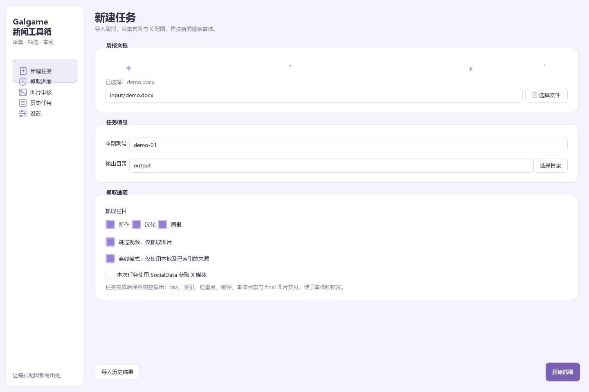
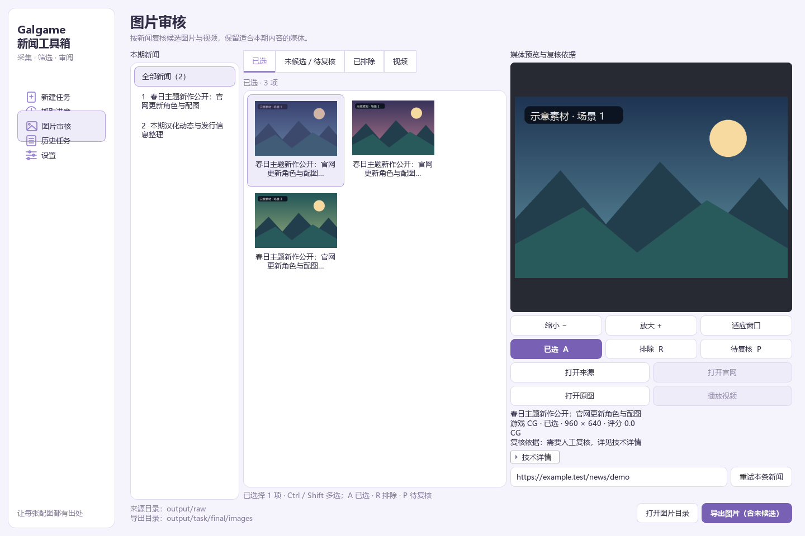
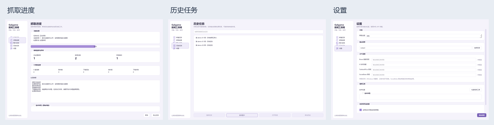
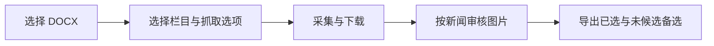

<p align="center">
  
</p>

<h1 align="center">周报图片采集工具箱</h1>

<p align="center">从一份 DOCX 开始，采集新闻配图、检查来源，再由你决定最终选图。</p>

<p align="center">
  
  
  
</p>

<p align="center">
  <a href="#功能一览">功能介绍</a> ·
  <a href="#快速开始">快速开始</a> ·
  <a href="docs/user/manual.md">使用手册</a> ·
  <a href="docs/user/faq.md">常见问题</a> ·
  <a href="https://github.com/kasumi-ppp/galgame-news/issues">问题反馈</a>
</p>

适合需要整理新作、汉化和周报配图的编辑及测试用户。工具箱负责收集和整理候选，你可以逐条新闻检查已选图片与“未候选”备选，并导出确认后的结果。

> 仓库名与程序界面仍沿用 `galgame-news` / “Galgame 新闻工具箱”。本文中的“周报图片采集工具箱”是项目对外介绍名称。以下截图来自离线演示数据，不代表真实抓取成果或筛选准确率。

## 界面预览

### 新建任务：选择栏目，明确本次抓取范围



### 图片审核：查看备选、核对来源、决定是否入选



<details>
<summary>展开查看抓取进度、历史任务和设置</summary>



完整截图：[抓取进度](docs/assets/screenshots/progress.png) · [历史任务](docs/assets/screenshots/history.png) · [设置](docs/assets/screenshots/settings.png)

</details>

## 功能一览

| 功能 | 可以做什么 |
| --- | --- |
| 新闻栏目选择 | 新作、汉化、周报独立勾选，保留原文档顺序与 `xN` / `hN` / `zN` 编号 |
| 官网图片采集 | 发现相关作品页、图库与商品详情；动态图库可启用浏览器补充采集 |
| 可选 X API | 配置自己的 SocialData 凭据后，按帖子提取媒体；每次任务默认关闭 |
| 汉化配图 | 识别 VNDB 发行记录对应作品及 Steam 本作品截图，优先获取高清原图 |
| 图片筛选 | 结合作品关联、图片级证据与原始质量筛选；确认同画面后在新闻内去重 |
| 人工审核 | 已选、未候选／待复核、已排除和视频分页；支持多选、快捷键、缩放及来源入口 |
| 图片交付 | PNG/JPG 审阅文件与新闻目录编号；合适的未候选备选随导出保留 |
| 任务恢复 | 暂停、继续、停止，历史任务重新审核及可恢复媒体续跑 |
| 中文桌面界面 | 浅色、深色和跟随系统；中文进度摘要与可展开的技术详情 |

X API 照片保留最高来源优先级，仍遵循新闻内去重和数量限制。其他来源的高清图片也需要作品关联和图片证据，不能仅凭来自 VNDB、Steam 或官网就自动入选。

### 一次任务的流程



## 快速开始

目前没有公开发布包，推荐从源码运行。已有私测包不属于公开下载入口。

在 Windows 上安装 **Python 3.11 或更新版本**，打开 PowerShell：

```powershell
git clone https://github.com/kasumi-ppp/galgame-news.git
cd galgame-news
python -m venv .venv
.\.venv\Scripts\python.exe -m pip install -e ".[desktop]"
.\.venv\Scripts\python.exe -c "from galgame_news.desktop.app import main; raise SystemExit(main())"
```

启动后选择 DOCX、期号和输出目录，勾选至少一个栏目，再点击“开始抓取”。建议首次使用保持“跳过视频，仅抓取图片”，SocialData 留为关闭。

需要动态图库浏览器组件时，安装可选依赖：

```powershell
.\.venv\Scripts\python.exe -m pip install -e ".[desktop,browser]"
.\.venv\Scripts\python.exe -m playwright install chromium
```

也可以使用命令行处理一份周报，**显式指定输出目录**：

```powershell
.\.venv\Scripts\python.exe -m galgame_news run "input/demo.docx" --issue demo --output "output/demo" --no-videos
```

`demo.docx` 是路径示例，请换成自己的文档。栏目复选框和每次任务的 SocialData 开关位于桌面界面，CLI 没有对应开关。[完整安装与启动说明](docs/user/quick-start.md)

## 图片与任务输出

任务保留完整数据，以便后续审核、追溯来源和恢复。主要结构如下（其他文件按任务情况生成）：

```text
output/<任务目录>/
├─ raw/                    # 采集索引、原件与审阅文件
├─ media_state/            # 媒体下载状态
├─ x_media_cache/          # 可用时保留的 X 媒体查询缓存
├─ checkpoint.json         # 可恢复任务进度
├─ request_options.json    # 本次任务选项
├─ review_state.json       # 人工审核决定
└─ final/
   └─ images/
      ├─ x1/
      │  ├─ x1.01.png      # 已选图片（扩展名按实际转换结果）
      │  └─ 未候选/
      │     └─ x1.u01.jpg  # 保留供人工选择的备选
      ├─ h1/
      └─ z1/
```

交付图片主要查看 `final/images`。继续审核或恢复任务时，保留整个任务目录，不要只留下最终图片。

“未候选”不再展示已确认的同画面重复版本，且图片原始长边至少 **800**、短边至少 **600** 像素。尺寸未知的失败记录保留供诊断；被过滤的有效图片仍可保留在内部资产与索引中，内部资产不等同于备选交付。详见[审核与输出说明](docs/user/manual.md)。

## 使用边界

- 自动选图需要人工确认，尤其是作品关系、动态页面、商品素材及新闻对应关系；本项目不承诺整体筛选准确率。
- SocialData 是可选的付费外部服务，需自行配置凭据。图片下载与媒体恢复尽量复用记录，费用以服务商实际账单为准。
- 公开源码、截图与文档不包含你的 API 密钥；不要在 Issue、截图或日志反馈中粘贴凭据。
- 视频是现有辅助功能，使用时需检查相关下载工具；图片任务可以直接跳过视频。
- 本仓库尚未声明项目整体开源许可证。第三方组件的许可证独立适用，见[第三方声明](packaging/THIRD_PARTY_NOTICES.md)及 [VNDB 适配来源](src/galgame_news/localization/PROVENANCE.md)。

## 文档与反馈

- [快速开始](docs/user/quick-start.md)：安装、启动、浏览器与 CLI。
- [使用手册](docs/user/manual.md)：新建任务、审核、导出与历史恢复。
- [常见问题](docs/user/faq.md)：X 缺图、未候选、导出失败与目录问题。
- [构建说明](packaging/README.md)：面向维护者的 Windows 打包流程。
- [提交问题](https://github.com/kasumi-ppp/galgame-news/issues)：请附操作步骤、版本、脱敏截图和必要诊断。
